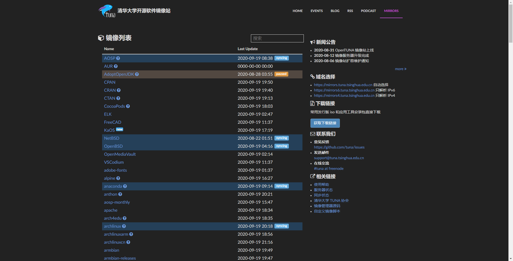
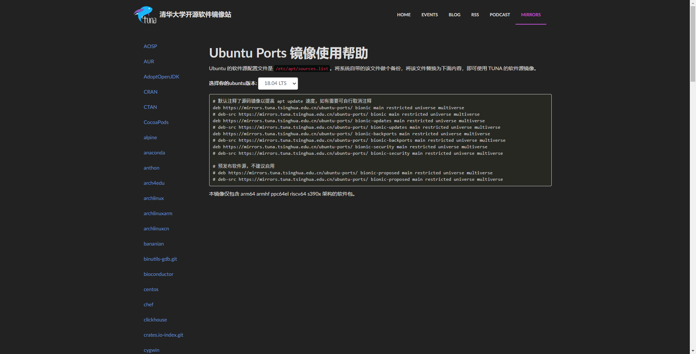
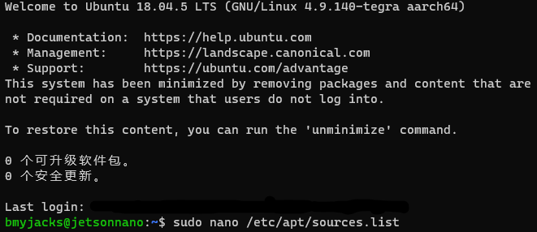

# 为Ubuntu更换国内的软件源

安装了Ubuntu后，运行`sudo apt update`时感觉速度一下子就慢下来了，是不是很拉跨？

现在就来将Ubuntu默认的软件源更换为国内的来提升  `update`与`install`的速度！

1.先来打开浏览器，进入[TUNA的官方软件园界面](https://mirrors.tuna.tsinghua.edu.cn/)



单击右部中间的[使用帮助](https://mirrors.tuna.tsinghua.edu.cn/help/ubuntu-ports/)进入帮助页面并向下滑动找到`ubuntu-ports`（使用amd64的请进入ubuntu）



选择Ubuntu版本为18.04 LTS后复制下方链接。

使用ssh登录Ubuntu客户端。

后使用

```bash
sudo nano /etc/apt/sources.list
```




将原本存在的行删除，替换为

```reStructuredText
deb https://mirrors.tuna.tsinghua.edu.cn/ubuntu-ports/ bionic main restricted universe multiverse
# deb-src https://mirrors.tuna.tsinghua.edu.cn/ubuntu-ports/ bionic main restricted universe multiverse
deb https://mirrors.tuna.tsinghua.edu.cn/ubuntu-ports/ bionic-updates main restricted universe multiverse
# deb-src https://mirrors.tuna.tsinghua.edu.cn/ubuntu-ports/ bionic-updates main restricted universe multiverse
deb https://mirrors.tuna.tsinghua.edu.cn/ubuntu-ports/ bionic-backports main restricted universe multiverse
# deb-src https://mirrors.tuna.tsinghua.edu.cn/ubuntu-ports/ bionic-backports main restricted universe multiverse
deb https://mirrors.tuna.tsinghua.edu.cn/ubuntu-ports/ bionic-security main restricted universe multiverse
# deb-src https://mirrors.tuna.tsinghua.edu.cn/ubuntu-ports/ bionic-security main restricted universe multiverse
deb https://mirrors.tuna.tsinghua.edu.cn/ubuntu-ports/ bionic-proposed main restricted universe multiverse
# deb-src https://mirrors.tuna.tsinghua.edu.cn/ubuntu-ports/ bionic-proposed main restricted universe multiverse
```


保存，退出。

在运行`sudo apt update`试试

是不是就快很多了呢！