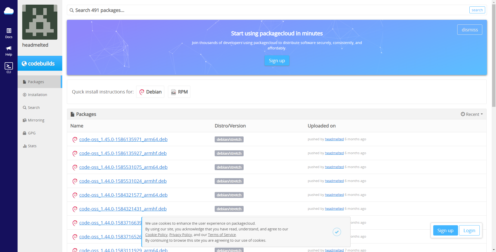
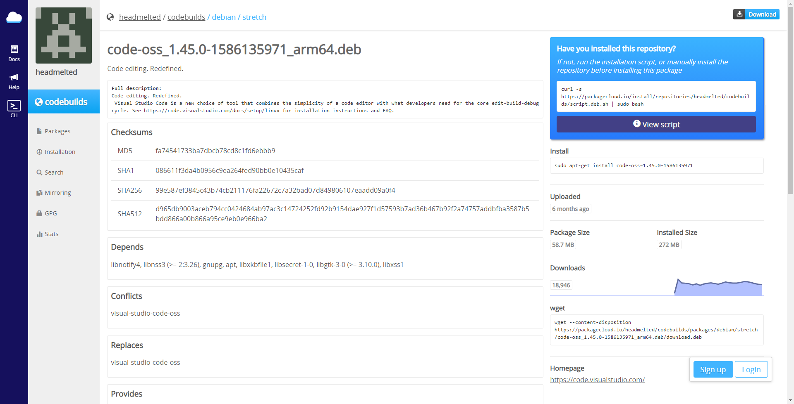

# 安装VScode
打开Chromiun

进入[https://packagecloud.io/headmelted/codebuilds](https://packagecloud.io/headmelted/codebuilds)



点击Packsges

看右边列出来的包名

后缀带有arm64(aarch64)的，点击查看wget命令



```bash
wget --content-disposition https://packagecloud.io/headmelted/codebuilds/packages/debian/stretch/code-oss_1.45.0-1586135971_arm64.deb/download.deb
sudo dpkg -i code-oss_1.45.0-1586135971_arm64.deb
```